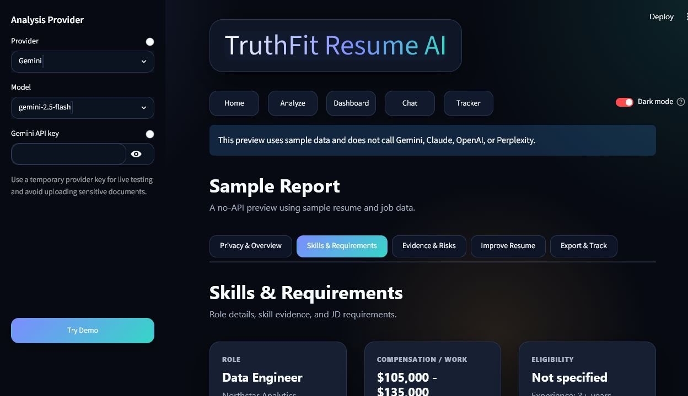
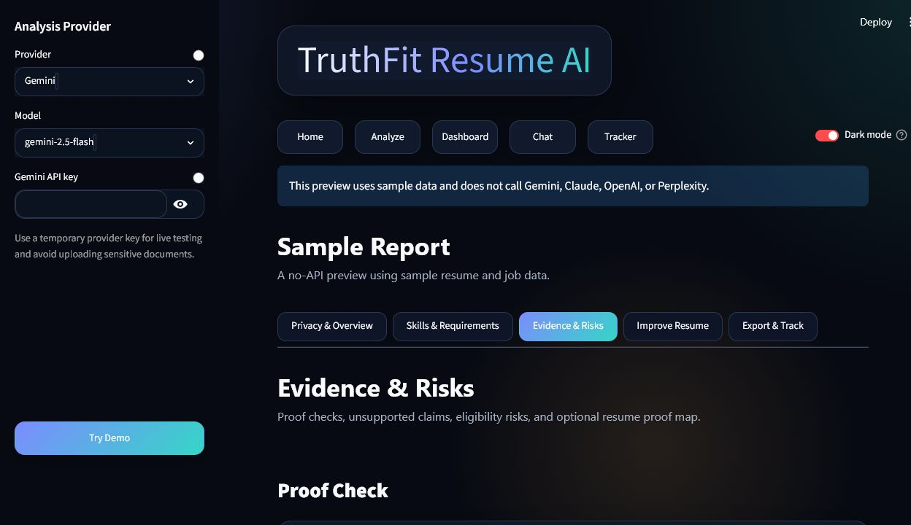
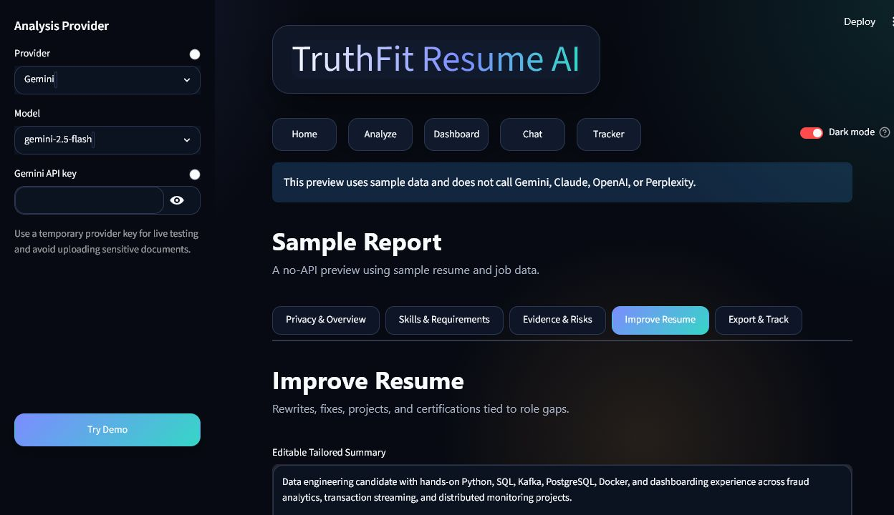
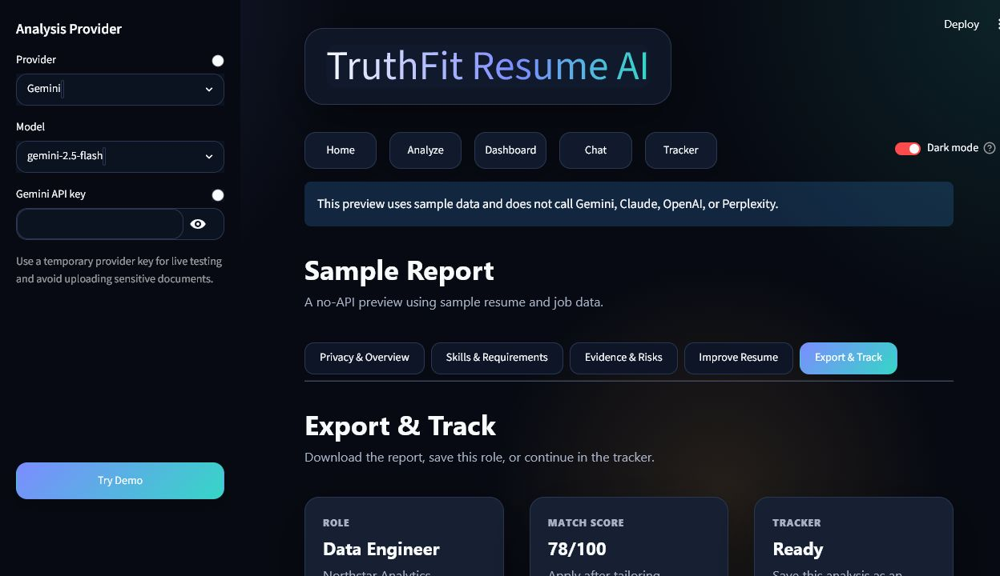
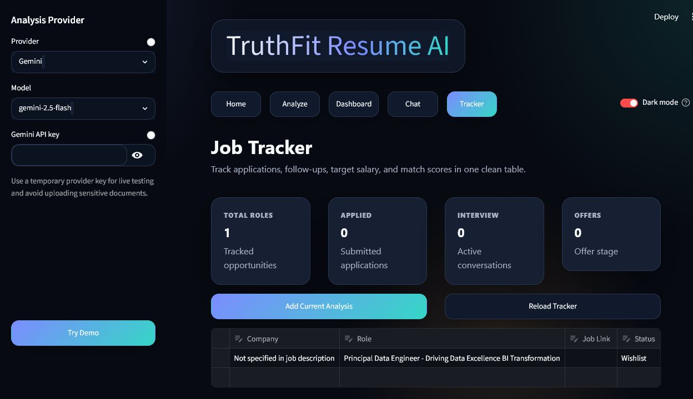

# TruthFit Resume AI

[](https://truthfit-resume-ai-vaos6czappyfazhugbyffub.streamlit.app/)

**Live app:** https://truthfit-resume-ai-vaos6czappyfazhugbyffub.streamlit.app/

TruthFit Resume AI is a privacy-first resume and job-fit review app. It compares a resume against a job description, explains the match score, checks whether resume claims are backed by real evidence, and turns gaps into practical next steps.

The goal is not to "game" an ATS or invent stronger experience. TruthFit is built around a simple idea: a resume should be tailored only with evidence that already exists in the candidate's work, projects, education, or portfolio.

## Screenshots

| Home | Analyze | Overview |
| --- | --- | --- |
|  |  |  |

| Skills & Requirements | Evidence & Risks | Improve Resume |
| --- | --- | --- |
|  |  |  |

| Export & Track | Job Tracker |
| --- | --- |
|  |  |

## What It Does

- Upload a resume as PDF, DOCX, or TXT.
- Upload or paste a job description.
- Add the original job posting link.
- Choose Gemini, Claude, OpenAI, or Perplexity with a bring-your-own-key setup.
- Generate a structured job-fit report with scores, evidence, risks, and action items.
- Use a no-API sample report so reviewers can explore the product without adding an API key.
- Track job applications with company, role, link, status, location, salary expectation, match score, priority, and notes.

## Core Features

### Privacy-First Review

TruthFit redacts detected personal details before resume preview, proof mapping, and live provider calls. It currently targets names, phone numbers, emails, URLs, and street-style addresses.

Uploaded resume and job-description files are not saved by the app. TruthFit uses session text for analysis and stores only local tracker data when a job-tracker entry is saved.

### Resume Evidence Score

TruthFit does not only ask "does this keyword appear?" It also checks whether claims are backed by concrete proof:

- work experience
- project evidence
- tools and technologies
- measurable outcomes
- education or certification details

This helps separate strong resume evidence from unsupported or vague claims.

### Score Explanation

The dashboard shows:

- overall match
- technical match
- ATS keyword coverage
- resume evidence proof
- eligibility fit
- experience fit
- score drivers that explain what raised or lowered the final score

### Skills and Requirements Review

The app compares the resume against must-have and nice-to-have job requirements, then shows matched and missing skills in a table with:

- skill
- status
- importance
- resume evidence
- suggested action

### Proof and Risk Checks

TruthFit flags gaps that could weaken an application:

- unsupported claims
- eligibility or location risks
- timeline issues
- missing requirement evidence
- claims that should be verified manually before rewriting the resume

### Resume Improvement Tools

The app can generate:

- tailored resume summary
- rewritten bullets grounded in existing evidence
- before/after bullet comparisons
- resume fix suggestions
- project suggestions
- certification suggestions
- optional cover letter

### Chat and Export

After an analysis is generated, the chat helper can answer follow-up questions, draft a cover letter, suggest recruiter outreach, or explain the score. The report can also be exported as a PDF.

## Dashboard Structure

The dashboard is organized around five product sections:

1. **Privacy & Overview**  
   Scores, verdict, privacy note, score drivers, resume evidence score, and top fixes.

2. **Skills & Requirements**  
   Job details, matched/missing skills, must-have requirements, nice-to-have requirements, and collapsed keyword details.

3. **Evidence & Risks**  
   Proof checks, unsupported claims, eligibility risks, timeline checks, JD red flags, and an optional resume proof map.

4. **Improve Resume**  
   Tailored summary, rewritten bullets, resume fixes, project ideas, certifications, and learning plan.

5. **Export & Track**  
   PDF export, job posting link, and job-tracker shortcut.

## Tech Stack

- Python
- Streamlit
- Plotly
- pandas
- pypdf
- python-docx
- Google Gemini API
- Anthropic Claude API
- OpenAI API
- Perplexity API
- pytest
- GitHub Actions

## Setup

1. Create and activate a virtual environment.

2. Install dependencies:

```bash
pip install -r requirements.txt
```

3. Copy `.env.example` to `.env` for local development, or enter a provider API key in the app sidebar:

```env
GEMINI_API_KEY=your_gemini_api_key_here
ANTHROPIC_API_KEY=your_anthropic_api_key_here
OPENAI_API_KEY=your_openai_api_key_here
PERPLEXITY_API_KEY=your_perplexity_api_key_here
```

4. Run the app:

```bash
streamlit run app.py
```

## Tests

Install the dev dependency and run the test suite:

```bash
pip install -r requirements-dev.txt
pytest -q
```

The test suite covers:

- resume and JD file loaders
- JSON extraction from messy LLM output
- job tracker normalization, save/load, and dedupe behavior
- PDF report generation
- UI text cleanup
- privacy redaction
- resume proof map generation
- resume evidence scoring

## Deployment

TruthFit can be deployed on Streamlit Cloud or Hugging Face Spaces.

For a portfolio deployment, the safest setup is:

- deploy the app publicly
- keep provider keys out of the repo
- let visitors use the no-API sample report
- let users enter their own provider API key for live analysis

See [DEPLOYMENT.md](DEPLOYMENT.md) for deployment steps.

## Limitations

- The ATS score is an approximation, not a real ATS simulation.
- Model output can be incomplete, inconsistent, or overconfident.
- PDF parsing can be messy for resumes with columns, tables, images, or unusual layouts.
- Privacy redaction is best-effort and should not be treated as legal or compliance-grade anonymization.
- Live analysis still sends redacted resume/JD text to the selected provider.
- The local job tracker is suitable for portfolio/demo use, not multi-user production storage.

## Roadmap

### 1. Project Recommendation Model

Build a stronger recommendation layer that maps missing role evidence to specific portfolio projects. Instead of generic project ideas, the model could suggest project scope, tech stack, resume bullet examples, difficulty, estimated timeline, and the exact job requirement each project would support.

### 2. Role-Specific Resume Modes

Add focused modes for different target roles, such as Data Engineer, Data Analyst, Analytics Engineer, Software Engineer, Machine Learning Engineer, and Business Analyst. Each mode could adjust scoring weights, keyword expectations, project suggestions, and resume rewrite guidance.

### 3. GitHub Evidence Extractor

Allow users to paste GitHub repository links and automatically extract project evidence from README files, tech stacks, commits, folder structure, and documentation. This would make project suggestions and resume proof scoring more grounded in real portfolio work.

### 4. Regional Targeting for India, GCC, and US Markets

Add region-aware resume and job-fit logic. Different markets often have different salary expectations, role titles, ATS keywords, notice-period norms, visa realities, relocation expectations, and recruiter screening patterns. A regional mode would make the analysis more practical for the selected target market.

### 5. React Frontend and API Backend

Move from a Streamlit-only interface to a React frontend with a Python API backend. This would allow a more polished product experience, better state management, richer dashboard interactions, user accounts, and cleaner separation between UI and analysis services.

### 6. Docker-Based Deployment

Containerize the production version with Docker after the architecture settles. If the app remains Streamlit-only, Docker is a straightforward deployment polish. If the frontend moves to React, containerization should cover the final frontend/backend setup rather than the current prototype structure.

### 7. Production Controls

Add authentication, server-side provider keys, usage limits, rate limiting, persistent storage, audit logs, and clearer data-retention settings for a real public product.

### 8. User Sessions and Login

Add user accounts so each person can save analyses, revisit job-tracker entries, and manage settings across sessions. A production version could use Firebase Auth for faster setup or a SQL-backed auth/session model for more control over user data, roles, subscriptions, and audit trails.

## Privacy Note

TruthFit redacts detected personal details before resume preview, proof mapping, and live analysis. Uploaded resume and job-description files are not saved by the app. Resume/JD text may still be sent to the selected AI provider during live analysis, so avoid uploading sensitive documents unless you are comfortable with that provider's data policy.

## Git Hygiene

The repo ignores local secrets, virtual environments, logs, tracker data, and generated reports. Do not commit `.env`, `.streamlit/secrets.toml`, real resumes, or private job application data.

## License

Copyright (c) 2026 Sarth.

This project is source-available for portfolio review only. Reuse, redistribution, sublicensing, or commercial use is not permitted without written permission. See [LICENSE](LICENSE).
