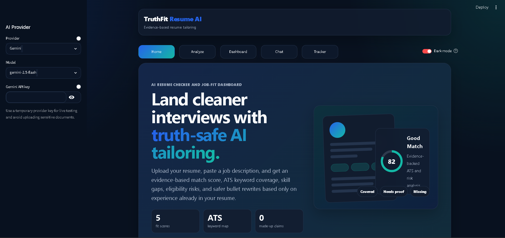
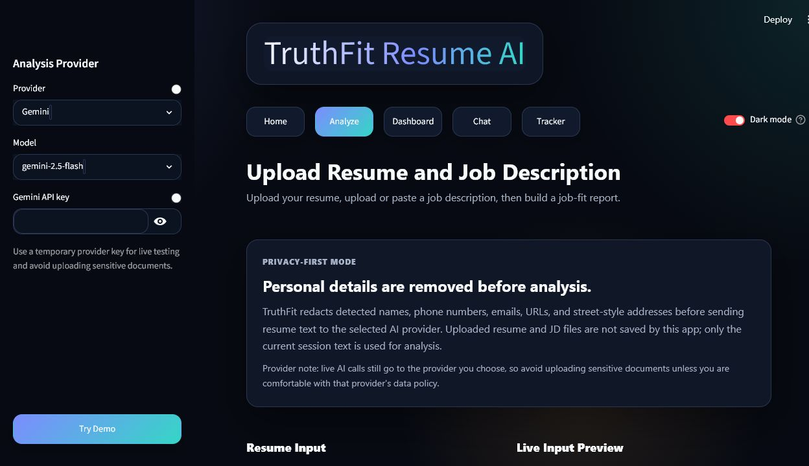
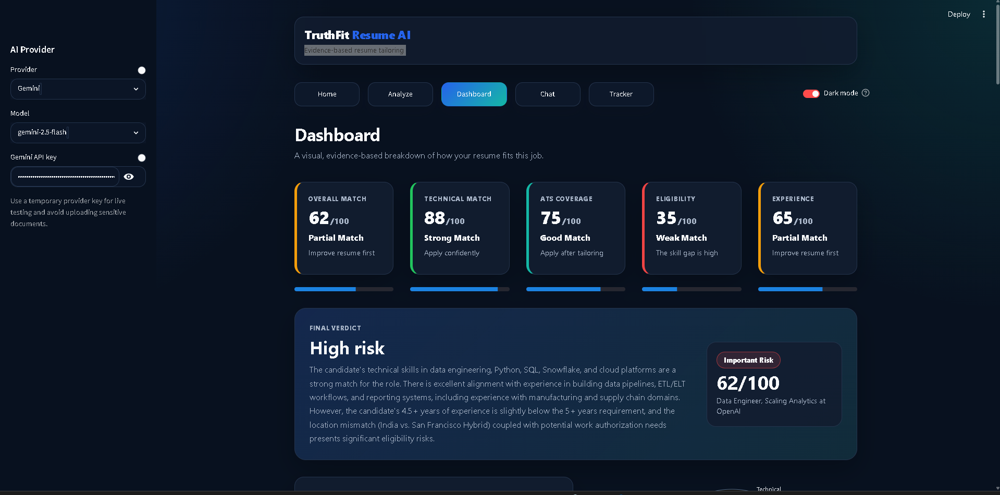
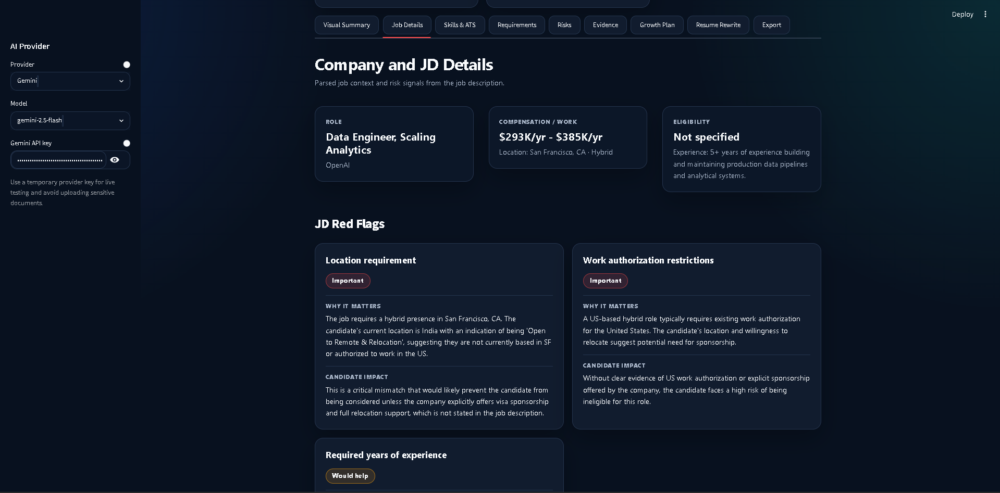
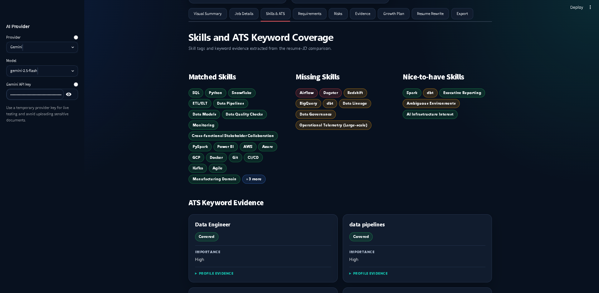
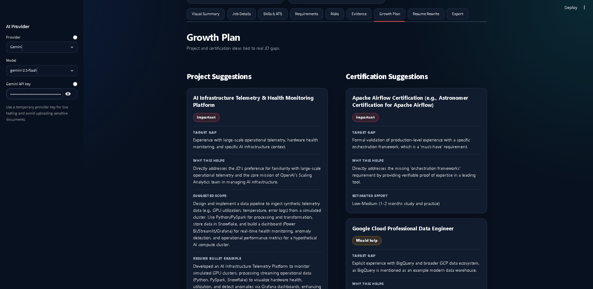
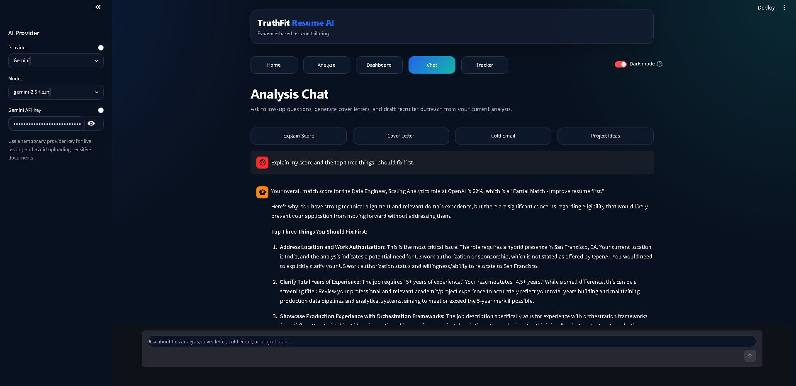
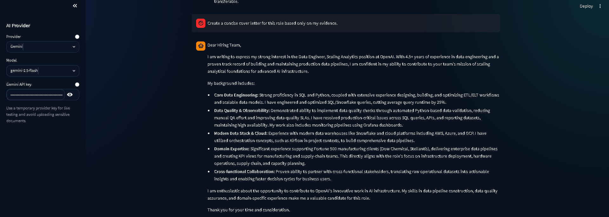
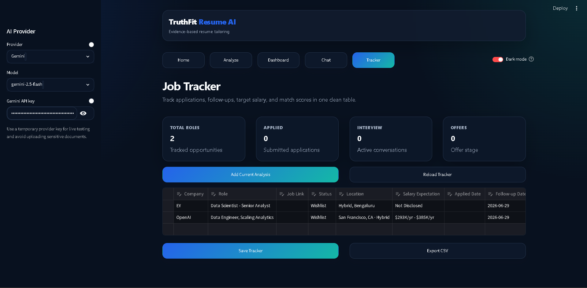

# TruthFit Resume AI

TruthFit Resume AI is a privacy-first resume and job-fit dashboard for comparing a resume against a job description. It shows fit scores, score drivers, ATS keyword coverage, resume evidence strength, skill gaps, resume rewrite ideas, project and certification suggestions, chat-based follow-up help, and a lightweight job tracker.

## Screenshots

| Landing | Analyze | Dashboard |
| --- | --- | --- |
|  |  |  |

| Job Details | Skills and ATS | Growth Plan |
| --- | --- | --- |
|  |  |  |

| Chat | Cover Letter | Job Tracker |
| --- | --- | --- |
|  |  |  |

## Features

- Resume upload for PDF, DOCX, and TXT files
- Job description upload or paste input
- Bring-your-own-key provider settings for Gemini, Claude, OpenAI, or Perplexity
- No-API demo dashboard for recruiters and reviewers
- Privacy-first resume preview that redacts detected names, phone numbers, emails, URLs, and street-style addresses before live analysis
- No-storage app behavior for uploaded resume/JD files; files are used in session and are not saved by the app
- Match scores for overall fit, technical fit, ATS coverage, resume evidence, eligibility, and experience
- Resume evidence score that checks whether claims are backed by concrete work, project, metric, or education proof
- Score driver bar explaining what raises or lowers the match score
- Evidence coverage meter for supported, partial, missing, and unsafe claims
- Matched vs missing skills table with importance, resume evidence, and next action
- Top fixes impact/effort matrix for prioritizing resume improvements
- Confidence and evidence check with resume evidence, JD evidence, risk, and manual verification guidance
- Visual dashboard with keyword, requirement, risk, and evidence sections
- Project and certification suggestions tied to missing JD evidence
- Chat helper for analysis questions, cover letters, cold emails, and rewrite help
- Editable job tracker with company, role, link, status, location, salary, and match score
- PDF report export
- Minimal pytest suite and GitHub Actions workflow for CI

## Tech Stack

- Python
- Streamlit
- Google Gemini API
- Anthropic Claude API
- OpenAI API
- Perplexity API
- Plotly
- pandas
- pypdf
- python-docx

## Setup

1. Create and activate a virtual environment.
2. Install dependencies:

```bash
pip install -r requirements.txt
```

3. Copy `.env.example` to `.env` for local development, or enter a provider API key in the app sidebar:

```env
GEMINI_API_KEY=your_gemini_api_key_here
ANTHROPIC_API_KEY=your_anthropic_api_key_here
OPENAI_API_KEY=your_openai_api_key_here
PERPLEXITY_API_KEY=your_perplexity_api_key_here
```

4. Run the app:

```bash
streamlit run app.py
```

## Tests

Install the dev dependency and run the test suite:

```bash
pip install -r requirements-dev.txt
pytest -q
```

The suite covers file loaders, messy LLM JSON extraction, tracker normalization and dedupe behavior, PDF report generation, UI text cleanup, resume privacy redaction, heatmap generation, and evidence scoring.

## Deployment

See [DEPLOYMENT.md](DEPLOYMENT.md) for Streamlit Cloud and Hugging Face Spaces deployment steps.

## Next Steps

- Add a short recorded demo video below the landing page.
- Add refreshed screenshots after the final dashboard layout is locked.
- Add auth, persistent storage, and server-side usage limits for a production deployment.

## Privacy Note

TruthFit redacts detected personal details before the resume preview, heatmap, and live LLM analysis. Uploaded resume and job-description files are not saved by the app. Resume/JD text may still be sent to the selected AI provider during live analysis, so avoid uploading sensitive documents unless you are comfortable with that provider's data policy.

## Git Hygiene

The repo ignores local secrets, virtual environments, logs, tracker data, and generated reports. Do not commit `.env`, `.streamlit/secrets.toml`, real resumes, or private job application data.

## License

Copyright (c) 2026 Sarth.

This project is source-available for portfolio review only. Reuse, redistribution, sublicensing, or commercial use is not permitted without written permission. See [LICENSE](LICENSE).
