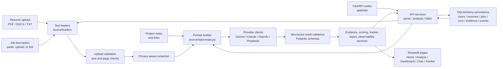
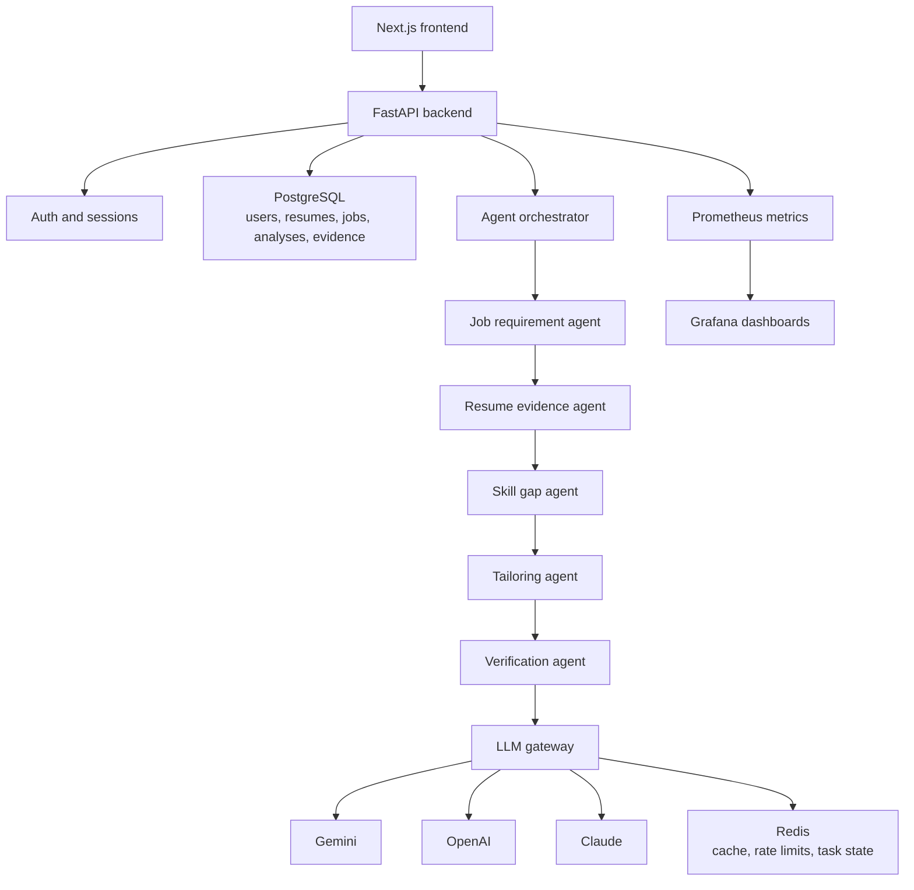

# TruthFit Architecture

TruthFit is currently a Streamlit-first portfolio application with an extracted FastAPI backend slice. The codebase is intentionally kept small enough to run from one public deployment, while the core logic is separated into loaders, AI providers, services, API routes, UI modules, and page modules.

## Current Architecture

## Current Boundaries

- `app.py` owns Streamlit bootstrapping, session state, theme state, provider settings, and top-level page routing.
- `apps/api/` exposes the Phase 1 FastAPI backend with parse, analysis, tailoring, health, and provider endpoints.
- `apps/api/app/db/` contains the Phase 2 SQLAlchemy models, database session management, and repositories.
- `source/pages/` contains user-facing page flows.
- `source/loaders/` validates and extracts resume/JD text.
- `source/ai/` builds prompts, calls LLM providers, validates structured output, and handles retry/fallback behavior.
- `source/services/` contains product logic that is not page-specific: evidence scoring, proof mapping, PDF export, job tracking, URL validation, sample reports, and observability.
- `source/ui/` contains reusable cards, charts, tables, layout helpers, text cleanup, and styles.
- `tests/` covers loaders, provider fallback, observability, scoring, report generation, tracker behavior, URL handling, and UI cleanup.

## Target Platform Architecture

The phase plan moves TruthFit toward a production-style platform:

## Migration Principle

Do not replace the working Streamlit app all at once. Preserve v1 as the public demo, then extract one stable API boundary at a time:

1. Keep the FastAPI backend and SQLAlchemy persistence passing tests while the Streamlit app remains the public demo.
2. Replace the local SQLite development fallback with managed PostgreSQL in deployed API environments.
3. Replace Streamlit UI with a Next.js frontend only after the backend contract is stable.
4. Add Redis, Docker, observability, Kubernetes, and Terraform after the core product behavior is proven.
